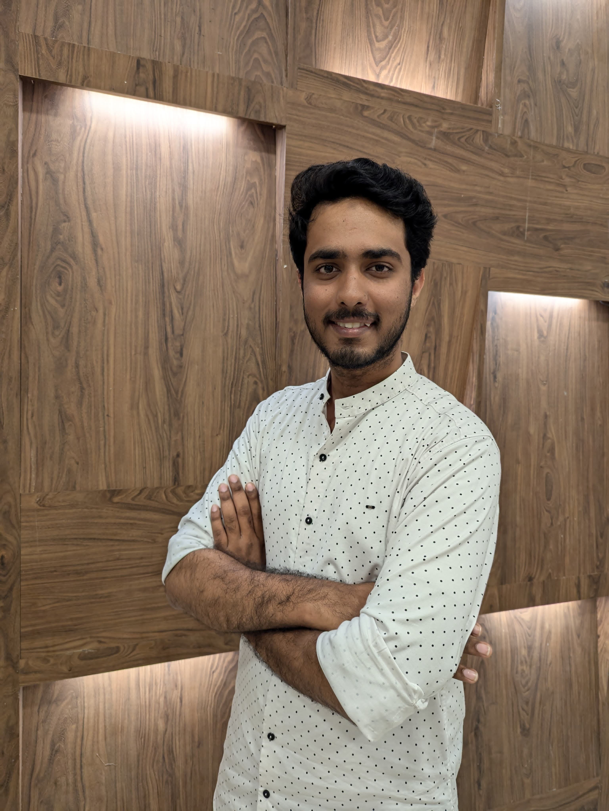

# 👋 Hi, I'm Fardeen S Khadri!  

🎓 **Python Developer | ECE Undergraduate | Tech Enthusiast**  
📍 Bengaluru, India | **Python Developer**  

---

## 🛠 **About Me**  

Welcome to my GitHub profile!  
I'm a passionate **Python Developer** currently pursuing a Bachelor's in **Electronics and Communication Engineering** . My journey revolves around combining my technical knowledge and creativity to develop **scalable, user-friendly solutions**. From building **AI-powered assistants** to **machine learning models**, I love solving real-world problems using technology.  

---
🌐 **Check out my portfolio:** [fardeenkhadri.github.io/portfolio](https://fardeenkhadri.github.io/portfolio)
---
## 🌟 **Technical Expertise**  

### **Programming Languages:**  
- **Python** | **MicroPython** | **C++** | **Rust** | **Embedded C** | **SQL**  
- **HTML** | **CSS** | **Assembly Language**

### **Technologies & Tools:**  
- **Machine Learning & Deep Learning:** YOLO, Flask, Dataset Annotation  
- **Scraping & Automation:** Selenium, BeautifulSoup4  
- **Operating Systems:** Windows, Red Hat Ubuntu, Mint, Kali Linux, Parrot, Fedora, Garuda  

### **Key Skills:**  
- **Leadership & Teamwork**: Proficient in leading teams and delivering collaborative results  
- **Public Speaking**: Skilled communicator with experience managing technical events and hackathons  
- **Analytics:** MS Power BI, Google Analytics  

---

## 🚀 **Projects**  

### [VISNAV - Visor Integrated System for Navigation](#)  
- **Goal:** Enhance road safety for motorcyclists with real-time alerts for heavy vehicle proximity.  
- **Technologies:** ESP32, YOLO v10, Python, Flask, IoT, Dataset Annotation  
- **Features:** Integrated AR, GPS, crash detection, and interactive rider assistance.

---

### [CAKES - Chromosomal Analysis Kit for Efficient Screening](#)  
- **Goal:** Optimized YOLO algorithm for medical chromosomal analysis with a confidence level of 0.96.  
- **Technologies:** YOLO, Flask, Python, Cytogenetics, Image Processing  
- **Outcome:** Demonstrated teamwork and technical proficiency in medical screening.

---

### [SHOPZEE](#)  
- **Goal:** Provide sentiment analysis for product reviews extracted via web scraping.  
- **Technologies:** BeautifulSoup4, Prompt Engineering, Python  
- **Features:** Advanced algorithms for insightful decision-making.

---

## 🏆 **Achievements & Leadership**  

- **Managing Director (Legacy Sentinel)** - Nanogram | **2024-2025**  
- **Core Committee Member** - Colossus | National Level Hackathon  
- **Hackathon Finalist** - Jovian Hackathon, Aventus (2022), Refine Hackathon  

---

## 📰 **Publications**  

### **VISNAV - Visor Integrated System for Navigation**  
- Tackles road safety for motorcyclists using innovative real-time alerts.  
- Published in: [IJIRT](https://ijirt.org/47859)

---

## 📜 **Certifications**  
- Python | AI for India 2.0 | SQL Boot Camp  

---

## 🔗 **Connect with Me**  

- **Email:** fardeeinshakhadrii@gmail.com  
- **LinkedIn:** [linkedin.com/in/fardeenkhadri](https://linkedin.com/in/fardeenkhadri)  
- **GitHub:** [github.com/fardeenKhadri](https://github.com/fardeenKhadri)  

---

## 🌟 **Let’s Collaborate!**  
I’m always eager to work on exciting projects or engage in meaningful discussions around **AI, IoT, and application development**. Feel free to reach out or check out my repositories!  
Currently working on building a Linux Distro
---

